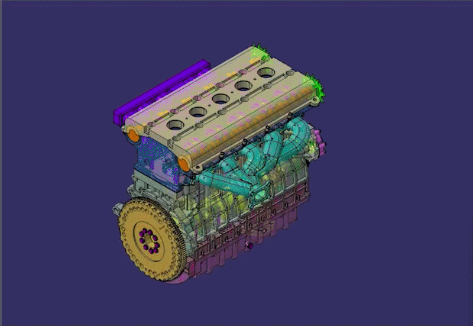
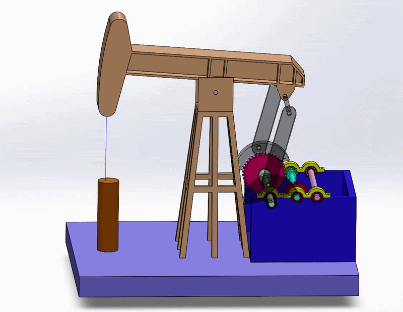

# Automotive-Engineering-Projects
CATIA and SolidWorks CAD design projects, featuring kinematics motion analysis.
# Automotive & Mechanical Engineering CAD Portfolio - Allen Wu

Welcome to my engineering design portfolio. This repository highlights my capabilities in advanced 3D parametric modeling, complex top-down assembly management, and kinematics motion simulation using industry-standard tools like CATIA and SolidWorks.

---

## 1. Volvo Inline-5 Engine Digital Replication
**Software:** CATIA V5R21
**Project Date:** March 2026  

### Project Overview
Executed a comprehensive, high-fidelity 3D parametric replication of a classic **Volvo Inline-5 internal combustion engine**. The design integrates automotive powertrain theory with advanced surface and solid modeling methodologies, informed by practical, hands-on engine teardown and maintenance experience.

### Key Technical Features
* **Complex Top-Down Assembly:** Managed intricate spatial constraints and mounting hierarchies for powertrain components, including the multi-journal crankshaft, piston sub-assemblies, and overhead valve train.
* **Advanced Routing & Surfacing:** Modeled custom-path exhaust manifolds and fluid intake systems ensuring optimal clearance with zero geometric interference.
* **Engineering Accuracy:** Replicated exact flywheel gear configurations and block casting profiles matching real-world mechanical layouts.

### Dynamic Preview

> 📂 **Download Engineering Source Files:** Due to the extensive size of this high-detail CAD dataset, the raw CATIA `.CATPart` and `.CATProduct` files are securely hosted externally. You can access and download the full technical model zip package [Here](https://1drv.ms/u/c/868680773f85527b/IQDbG_u1T09LTb0vYK9dxz36AVabrwks4YBroadEvaPOah8).

---

## 2. Industrial Pumpjack Mechanism with Two-Stage Gear Reduction
**Software:** SolidWorks  
**Project Date:** January 2026  

### Project Overview
Designed and engineered a fully operational multi-component industrial **pumpjack mechanism** (oil extraction beam pump) featuring an integrated two-stage gear reduction gearbox. This project focuses heavily on link-mechanism kinematics, structural balancing, and mechanical torque transmission efficiency.

### Key Technical Features
* **Kinematics & Motion Analysis:** Successfully configured advanced mechanical mate constraints and conducted a full **SolidWorks Motion Study** to simulate the four-bar linkage inversion, ensuring smooth vertical counterbalanced rod stroke without mechanical binding.
* **Gearbox Transmission Design:** Modeled a multi-stage precision gear reduction system, maintaining proper diametral pitch, face width tolerances, and precise shaft alignment under alternating dynamic loading conditions.
* **Manufacturing Documentation:** Structured the engineering layout for drafting GD&T-compliant 2D technical drawings and generating an itemized Bill of Materials (BOM) for fabrication planning.

### Kinematics Simulation

---

## Technical Skills Summary
* **CAD & Product Design:** CATIA, SolidWorks (Advanced Assembly, Motion Study), AutoCAD
* **Engineering Tools:** MATLAB, Multisim (Circuit Analysis), Basic C++
* **Hands-on Expertise:** Internal Combustion Engine (ICE) Disassembly/Reassembly, Mechanical Troubleshooting
